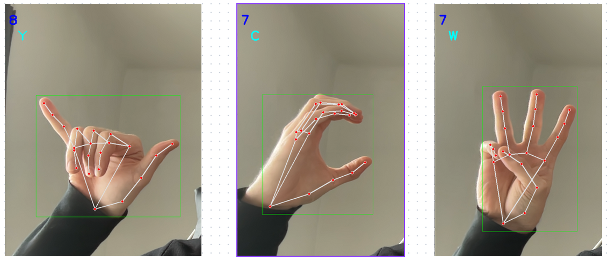
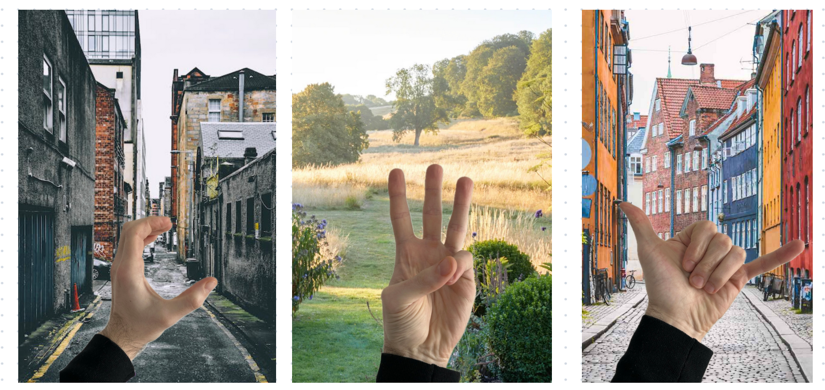
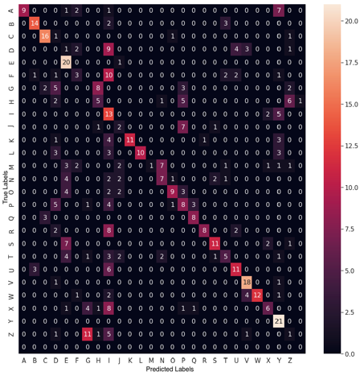

# Real Time Hand Gesture Recognition on Resource Limited Devices - Bachelor's Thesis

## Abstract:

In this thesis, we tackle a common challenge: improving communication between deaf and non-deaf individuals. Despite the availability of sign language courses, few have the chance to learn. However, technological advancements offer new solutions to bridge this gap.
Our project leverages real-time image processing to interpret American Sign Language (ASL) gestures through a smartphone camera. We employ machine learning techniques to achieve this, despite facing hurdles such as acquiring a clean, normalized dataset, addressing overfitting, and optimizing for mobile devices with limited processing capabilities.
Our application can detect a person's hand and identify the ASL letter being signed, proving to be a valuable tool in interactions with the deaf community.

## Dataset:

For the dataset we downloaded 87000 pictures from kaggle https://www.kaggle.com/datasets/grassknoted/asl-alphabet, so we ended up having
3000 pictures per class.
Since the pictures were taken in front of a grey background we performed some Data Augmentation to introduce noise in the background
because otherwise our model would overfit on the gray background.
with the help of pixxellib https://pypi.org/project/pixellib/, we separated the hand and the backgrounds 
and we generated new images like below to have different background, kind of simulating a real world environment.

## Transfer Learning:

We applied Transfer Learning on a ResNet model and we got the following confusion matrix:

We can see that in the case of a few letter there are differences, 
in a few cases there is only a slight difference between two letters for example M or N.

